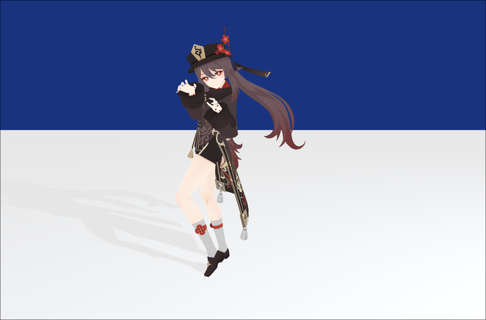
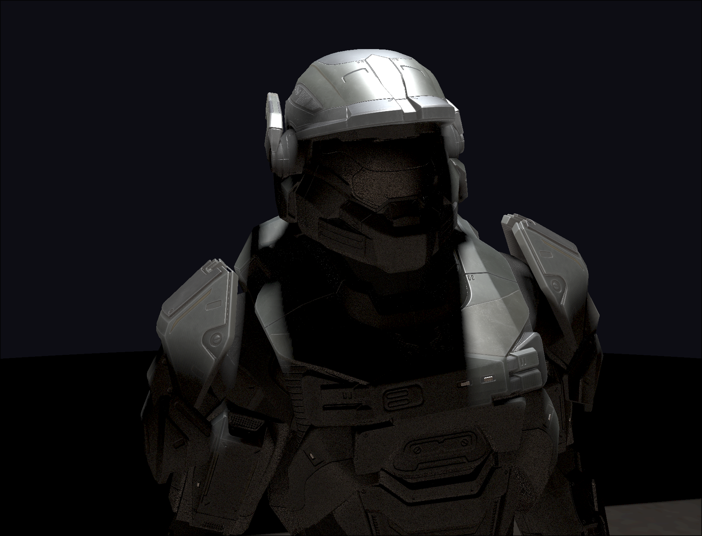

# MLGL Renderer

This is originally a final project for my Computer Graphics course. Later I decided to keep working on it and added some new features.

This will also my last renderer implemented in OpenGL. Later I'll learn Vulkan and use that as the primary Graphics API.

This renderer supports the following features:

* Shadowmap

* Skeletal&Morph Animation

* Skybox

* PBR

* Real-time global illumination based on RSM.

Since I didn't decide publishing this before, I didn't keep track on all the third party resources I used. If you find the dependencies
or resource of this project is infringing your or other's copyright, please contact me through my email: [oppositenormal@outlook.com](oppositenormal@outlook.com)

# How to Build

Clone the repository with all the sobmodules

```shell
git clone --recursive https://github.com/OppositeNor/last-opengl-project.git
cd last-opengl-project
```

Install build utilities and dependencies:

- Arch Linux

```shell
sudo pacman -S gcc ninja cmake
yay -S icu
```

Build the project using the local dependencies

```shell
# Debug
cmake -B build -G Ninja -DUSE_LOCAL_DEPS=ON
cmake --build build

# Release
cmake -B release -G Ninja -DUSE_LOCAL_DEPS=ON -DCMAKE_BUILD_TYPE=Release
cmake --build release --config Release
```

Some rendering results are shown bellow:

Run with command line argument `morph`:



Run with command line argument `pbr`:



Run with no command line argument provided:


